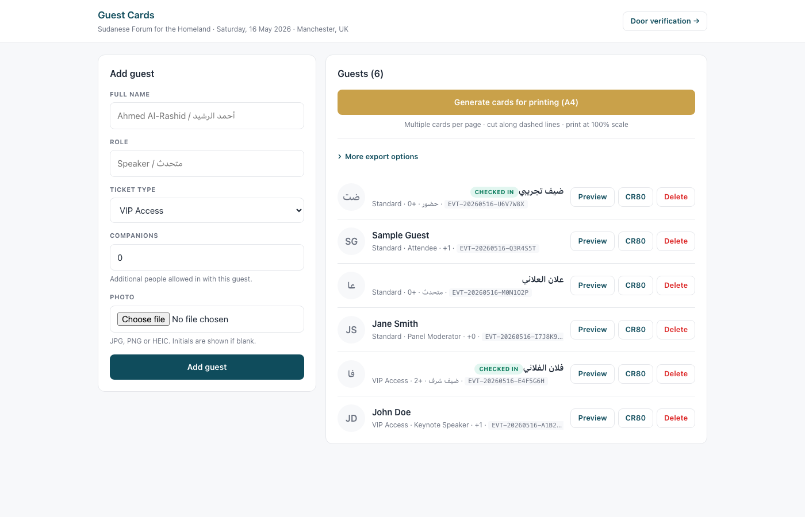

# Event Cards System (ECS)

A self-hosted Flask app for generating event guest cards with scannable QR codes and a door-verification flow. Bilingual-ready (English / Arabic), themeable, and fully configurable through an in-browser setup wizard — no code changes required to run your own event.



## Features

- **In-browser setup wizard** — define your event title, dates, fields, languages, logo, and card theme without editing any code.
- **Dynamic guest fields** — text, select, and number field types; choose which ones appear on the printed card.
- **5 built-in card themes** plus a live color editor for per-event customization.
- **Bilingual cards** — Arabic and English side by side, with proper shaping (`arabic-reshaper`) and bidirectional layout (`python-bidi`). Either language can be toggled off.
- **PDF exports**
  - A4 or Letter print sheets, multiple cards per page with dashed cut lines
  - CR80 conference-badge size (3.375" × 2.125") or full event-card size
- **QR codes** — every guest gets a unique `EVT-YYYYMMDD-XXXXX` code, rendered as a QR for reliable phone-camera scanning.
- **Door verification** — security scans the QR (camera or USB scanner), sees the guest's photo and details; each code is single-use to prevent reuse.
- **Mobile-first UI** — sticky header, 44 px tap targets, responsive layout.
- **Localhost-only by default** — the dev server binds to `127.0.0.1`, not your LAN.

## Quick start

```bash
git clone https://github.com/Abdelrhman-Rayis/event-cards-system.git
cd event-cards-system
python3 -m venv .venv
source .venv/bin/activate
pip install -r requirements.txt
python app.py
```

Open http://127.0.0.1:5151.

## Setting up your event

Everything is configured from the browser. From the home page, click **Event setup** (top-right). The wizard has three numbered sections:

### 1. Event basics

| Field | Example | Notes |
|---|---|---|
| Title (primary) | `Annual Conference` | First header line |
| Title (secondary) | `2026 Edition` | Smaller second line, optional |
| Date | `Saturday, 16 May 2026` | Free-form display string |
| Time | `17:00 – 23:00` | Free-form display string |
| Location | `Manchester, UK` | Shown under the date/time |
| Date code | `20260516` | Used as the prefix of every guest's QR code (`EVT-20260516-XXXXX`) |

For bilingual events, tick **Arabic** under *Languages* and fill in the Arabic title fields. Untick languages you don't need.

### 2. Ticket fields

Define what to capture for each guest. The home-page form is generated from this list. For every field you pick:

- **ID** — internal key (e.g. `role`, `seat_number`). Must be unique.
- **Label** — what the user sees on the form.
- **Type** — `text`, `select`, or `number`.
- **Show on card** — whether the field is rendered onto the printed card.
- **Default** — pre-filled value when adding a new guest.
- For `select`: comma- or newline-separated **options**.
- For `number`: **min** / **max** bounds.

Common examples:

```
role        text    "Speaker", "Guest", "Staff"
ticket_type select  VIP / Standard / Press / Sponsor
companions  number  0 – 10 extra people allowed in
```

### 3. Card template

Pick one of the five built-in themes:

- **Classic Navy & Gold** — cream header, deep navy, warm gold accents
- **Minimal Black & White** — magazine-clean monochrome
- **Modern Vibrant** — bold coral accent over soft slate
- **Corporate Blue** — clean professional blue
- **Wedding Elegant** — blush + champagne, formal

### Logo

In the *Header Logo* section, upload a PNG/JPG/WebP. It is normalized to `static/logo.png` and shown at the top of every card. Untick **Remove current logo** to keep the existing one.

### Hit Save

Save reloads the config in-memory — no restart needed. Add a guest from the home page and it'll appear with all your fields.

## Fine-tuning colors (optional)

If a built-in theme is *almost* right, open **Style editor** (top-right, or `/editor`). You get a live preview alongside color pickers for every layer (header background, primary text, accent, dividers, etc.). Only the colors you actually change are written back into `event.json` — the rest stay tied to the base theme, so you can switch themes later without losing your tweaks.

## Adding guests

From the home page:

1. Type the guest's name.
2. (Optional) Upload a photo.
3. Fill in whatever ticket fields you defined.
4. Click **Add guest** — a row appears in the list with the unique code.

From there you can:

- **Preview** the card as PNG (event size or conference-badge size)
- **Generate** a single-card-per-page PDF
- **Print sheets** — A4 or Letter, multiple cards per page with cut lines
- **Delete** a guest (removes their photo too)

## Door verification

Open `/verify` on a phone, tablet, or laptop at the entrance. Scan a guest's QR code (camera in the browser, or paste from a USB scanner). The page shows the guest's name, photo, and ticket details, then marks the code as used so it can't be re-scanned for a second person.

## Routes

| Path | Purpose |
|---|---|
| `/` | Manage guests, export options |
| `/setup` | Event setup wizard |
| `/editor` | Style editor (live color preview) |
| `/preview/<code>?format=event\|conference` | Render a single card as PNG |
| `/generate?format=event\|conference` | One-card-per-page PDF |
| `/generate/print-sheets?paper=a4\|letter&format=event\|conference` | Multi-card print sheet PDF |
| `/verify` | Door verification (camera or manual entry) |
| `/photo/<filename>` | Serve uploaded guest photos |
| `/add`, `/delete/<code>` | Form endpoints |

## `event.json` schema

The wizard writes to this file; you can also hand-edit it.

```json
{
  "schema_version": 1,
  "title_primary": "Annual Conference",
  "title_secondary": "2026 Edition",
  "title_primary_ar": "المؤتمر السنوي",
  "title_secondary_ar": "نسخة 2026",
  "date": "Saturday, 16 May 2026",
  "time": "17:00 – 23:00",
  "location": "Manchester, UK",
  "date_code": "20260516",
  "languages": ["en", "ar"],
  "fields": [
    {
      "id": "role",
      "label": "Role",
      "type": "text",
      "show_on_card": true,
      "default": "Guest"
    },
    {
      "id": "ticket_type",
      "label": "Ticket Type",
      "type": "select",
      "show_on_card": true,
      "default": "Standard",
      "options": ["VIP", "Standard", "Press", "Sponsor"]
    },
    {
      "id": "companions",
      "label": "Guests",
      "type": "number",
      "show_on_card": true,
      "default": 0,
      "min": 0,
      "max": 10,
      "display_format": "companion_label"
    }
  ],
  "template": {
    "id": "corporate_blue",
    "overrides": {}
  }
}
```

`template.overrides` is written by the style editor — anything you change there appears as `colors.<key>: [R, G, B]` inside `overrides`, and is layered on top of the chosen theme.

## Tech stack

- **Flask** (application factory + blueprints)
- **Pillow** — card rendering
- **qrcode** — QR code generation
- **arabic-reshaper** + **python-bidi** — Arabic script handling
- **html5-qrcode** (CDN) — in-browser camera scanning

## Privacy

Guest data is stored locally in `guests.json` and `photos/`. **Both paths are gitignored** — they are never committed. Guests are PII; treat the file like a contact list.

## Project layout

```
app.py                       Flask entry point (gunicorn-compatible shim)
event.json                   Event config — written by the setup wizard
requirements.txt             Python dependencies
event_cards/                 Application package
├── __init__.py              create_app() factory + blueprint registration
├── config.py                Paths, event.json load/save
├── models.py                Guest persistence, code generation
├── rendering/
│   ├── card.py              Pillow card renderer
│   ├── pdf.py               Multi-card sheet + single-card PDF
│   ├── themes.py            5 built-in themes + override merging
│   └── fonts.py             Font discovery
├── routes/
│   ├── guests.py            Index, add, delete, photo serving
│   ├── cards.py             PNG preview + PDF endpoints
│   ├── setup.py             /setup wizard
│   ├── editor.py            /editor live-preview color editor
│   └── verify.py            /verify door scanner
└── templates/               Jinja templates
static/logo.png              Event logo (uploadable from wizard)
guests.json                  (gitignored) per-event guest list
photos/                      (gitignored) uploaded guest photos
output/                      (gitignored) generated PDFs scratch dir
```
